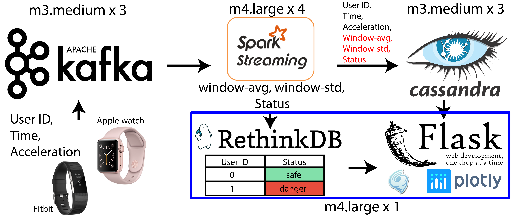

# Acalert

A data pipeline for saving lives


- [Live DEMO](http://www.acalert.stream/)
- [Project Slides](http://www.acalert.stream/slides)


## Motivation

Accidents can happen anywhere in our daily lives. It can happen when you are climbing, or driving. In fact, it is the 4th leading cause of death in the U.S. 
Each year, more than 200,000 people died from accidents in the U.S. 
That’s why this is important.

The idea of my project is the following. If we could detect those accidents happening in real-time, we could potentially save lives.
For example, imagine we have real-time streaming data of user activities from wearable devices, or smart phones. Those data would come to a system, which could tell if a user is safe, or in danger. Then, if we find a user in danger, using the GPS location data from the user, we can send medical support if needed.

## Pipeline



So, I build the following pipeline. I have randomly generated data stream containing user id, time, and acceleration, simulating the data from users’ device. I used an ingestion engine, kafka, to receive the data stream. 
Next, I use spark streaming to consume the data from kafka and perform the data processing. It does two tasks. One is calculating the window-average and window-standard-deviation for each user and each window. The other is taking the original data from each user and each window, compare them to the window-average and window-standard-deviation. Then, based on given criteria, flag a record as normal or anomaly. 
All of the data will then be written into the cassandra database, including window-average and window-standard-deviation. 
Then, a table which only contain the current status of each user is saved in a rethinkDB database. The reason to use a separate rethinkDB database is that, if there is any change in the status table, instead of doing a potentially time-consuming query, rethinkDB will automatically push the real-time update to the dashboard.
Finally, I use flask to build the webUI. 
With 2000 users and a 10 second window, my pipeline can handle 2000~3000 records per second.

## Deployment

The directory tree is illustrated as the following:

```
.
├── README.md
├── cassandra
│   └── createTable.py
├── figs
│   ├── pipe.pdf
│   ├── pipe.png
│   ├── screen.pdf
│   ├── screen.png
│   ├── screen_0.png
│   └── screen_1.png
├── flask
│   ├── app
│   │   ├── __init__.py
│   │   ├── static
│   │   │   ├── css
│   │   │   │   ├── bootstrap-theme.css
│   │   │   │   ├── bootstrap-theme.css.map
│   │   │   │   ├── bootstrap-theme.min.css
│   │   │   │   ├── bootstrap-theme.min.css.map
│   │   │   │   ├── bootstrap.css
│   │   │   │   ├── bootstrap.css.map
│   │   │   │   ├── bootstrap.min.css
│   │   │   │   ├── bootstrap.min.css.map
│   │   │   │   ├── button.css
│   │   │   │   ├── ie10-viewport-bug-workaround.css
│   │   │   │   ├── starter-template.css
│   │   │   │   └── table.css
│   │   │   ├── fonts
│   │   │   │   ├── glyphicons-halflings-regular.eot
│   │   │   │   ├── glyphicons-halflings-regular.svg
│   │   │   │   ├── glyphicons-halflings-regular.ttf
│   │   │   │   ├── glyphicons-halflings-regular.woff
│   │   │   │   └── glyphicons-halflings-regular.woff2
│   │   │   └── js
│   │   │       ├── bootstrap.js
│   │   │       ├── bootstrap.min.js
│   │   │       ├── ie10-viewport-bug-workaround.js
│   │   │       ├── movingTrace.js
│   │   │       ├── npm.js
│   │   │       ├── plot.js
│   │   │       ├── rethinkDB.js
│   │   │       └── socketwork.js
│   │   ├── templates
│   │   │   ├── aboutMe.html
│   │   │   ├── base.html
│   │   │   ├── index.html
│   │   │   └── mybase.html
│   │   └── views.py
│   ├── run.py
│   └── tornadoapp.py
├── kafka
│   ├── createTopic.sh
│   ├── kafka_producer.py
│   └── run_kafka_producer.sh
├── rethinkDB
│   └── createTable.py
└── spark
    ├── run_streaming.sh
    └── streaming.py
```

###### Requirement
[pegasus](https://github.com/insightdatascience/pegasus)


## Future work

There are many future works to improve this project.
1. More stress testing. For example, take down a node in the kafka cluster, spark cluster, or cassandra cluster and see how the pipeline react to those situation.
2. So far, all of the records in the data streaming are ordered. But, in reality, the records in the data stream could be unordered. Then, the stream processing will need to window based on event-time instead of arriving time. In that case, the spark streaming in the pipeline will need to be replaced with spark structured streaming.
3. The criteria to detect anomaly currently is based only on window-average and window-standard-deviation. The ideal solution would be adding additional component to allow data scientist build a ML model and tune the parameters.

